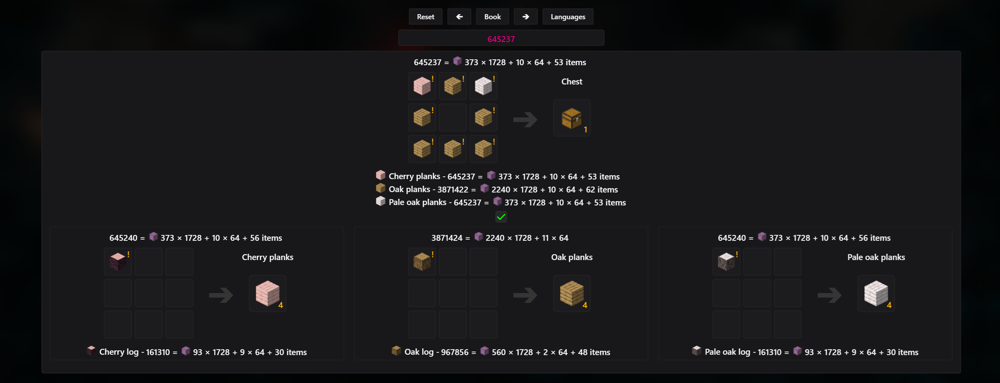

# Minecraft Calculator

**Minecraft Calculator** — is a tool designed for calculations and optimization in Minecraft.
Whether you are working on complex building projects, automating processes, or just want to make the most efficient use of resources, this calculator will be your indispensable assistant.

## Current Crafting Recipes

- **ver. Minecraft 1.21.9/10**

## Features

- **Resource Calculation:** Find out how many materials you will need for your project.
- **Recipe Optimization:** Quickly find the most efficient crafting method.

## Contributing

If you have ideas or found a bug, please create an [issue](https://github.com/JuraRusan/Minecraft-calculator/issues).

---

This website is not an official product of Mojang. It was developed by an enthusiast to provide a helpful tool for Minecraft players. All features are created solely for personal and public use and are not affiliated with the official support or development of Mojang.

Images used were created with the [Isometric Renders](https://modrinth.com/mod/isometric-renders) mod.

### Created with love for Minecraft 🌱

# Minecraft Calculator

**Minecraft Calculator** — это инструмент, созданный для расчётов и оптимизации в игре Minecraft.
Если вы занимаетесь сложными строительными проектами, автоматизацией процессов или просто хотите максимально эффективно использовать ресурсы, этот калькулятор станет незаменимым помощником.

## Актуальные крафты

- **ver. Minecraft 1.21.9/10**

## Возможности

- **Расчёт ресурсов:** Узнайте, сколько материалов понадобится для вашего проекта.
- **Оптимизация рецептов:** Быстро находите оптимальный способ крафта.

## Вклад в проект

Если у вас есть идеи или вы нашли баг, создайте [issue](https://github.com/JuraRusan/Minecraft-calculator/issues).

---

Этот сайт не является официальным продуктом компании Mojang. Он был разработан энтузиастом с целью предоставить полезный инструмент для игроков Minecraft. Все функции созданы исключительно для личного и публичного использования и не связаны с официальной поддержкой или разработкой Mojang.

Изображения, которые используются, были созданы с помощью мода [Isometric Renders](https://modrinth.com/mod/isometric-renders).

### Создано с любовью к Minecraft 🌱
