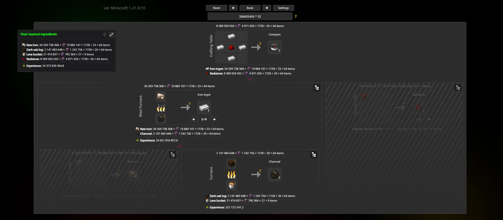

# Minecraft Calculator

**Minecraft Calculator** — це інструмент для розрахунків та оптимізації у Minecraft.  
Незалежно від того, чи працюєте ви над складними будівельними проєктами, автоматизацією процесів або просто намагаєтесь ефективніше використовувати ресурси, цей калькулятор допоможе вам краще планувати.

## Підтримувана версія Minecraft

- **Minecraft Java Edition 1.21.9/10**

### Підтримувані типи рецептів

- Верстак (формений крафт)
- Верстак (безформений крафт)
- Трансмутація
- Каменеріз
- Переплавка
- Плавка
- Копчення
- Готування на багатті
- Ковальське покращення

> Рецепти варильної стійки плануються в майбутніх оновленнях.

## Можливості

- **Розрахунок ресурсів:** Оцінюйте кількість матеріалів, необхідних для ваших проєктів.
- **Оптимізація рецептів:** Знаходьте найефективніші шляхи крафту.
- **Рекурсивні дерева крафту:** Розкладайте рецепти до базових інгредієнтів.
- **Підтримка палива:** Розраховуйте необхідну кількість палива для рецептів, пов’язаних із піччю.

## Дані

- Ігрові дані (`recipes`, `fuels`, `stacks`) зберігаються у форматі JSON в `public/data/`.
- Генеруються за допомогою власного скрипта на основі оригінальних файлів даних Minecraft (Java Edition).

> JSON-файли генеруються автоматично. **Не редагуйте їх вручну**.

## Внесок у проєкт

Якщо у вас є ідеї, пропозиції або ви знайшли помилку — створіть [issue](https://github.com/JuraRusan/Minecraft-calculator/issues).

---

Цей вебсайт не пов’язаний із Mojang і не підтримується компанією.  
Він був створений як незалежний проєкт для допомоги гравцям Minecraft.

Зображення були створені за допомогою моду [Isometric Renders](https://modrinth.com/mod/isometric-renders) або взяті з [mc-assets](https://github.com/Owen1212055/mc-assets).  
Деякі текстури та іконки, використані в проєкті, не були створені мною та належать їхнім відповідним власникам.

### Створено з любов’ю до Minecraft 🌱

---

# Minecraft Calculator

**Minecraft Calculator** is a tool for calculations and optimization in Minecraft.  
Whether you're working on complex building projects, automating processes, or simply trying to use resources efficiently, this calculator helps you plan better.

## Supported Minecraft Version

- **Minecraft Java Edition 1.21.9/10**

### Supported Recipe Types

- Crafting Table (Shaped)
- Crafting Table (Shapeless)
- Crafting Transmute
- Stonecutting
- Smelting
- Blasting
- Smoking
- Campfire Cooking
- Smithing Transform

> Brewing Stand recipes are planned for future updates.

## Features

- **Resource Calculation:** Estimate materials required for your projects.
- **Recipe Optimization:** Find the most efficient crafting paths.
- **Recursive Craft Trees:** Break recipes down into base ingredients.
- **Fuel Support:** Calculate fuel requirements for furnace-based recipes.

## Data

- Game data (`recipes`, `fuels`, `stacks`) is stored as JSON in `public/data/`.
- Generated using a custom script based on original Minecraft (Java Edition) data files.

> JSON files are auto-generated. **Do not edit them manually**.

## Contributing

If you have ideas, suggestions, or found a bug, please open an [issue](https://github.com/JuraRusan/Minecraft-calculator/issues).

---

This website is not affiliated with or endorsed by Mojang.  
It was created as an independent project to help Minecraft players.

Images were created using the [Isometric Renders](https://modrinth.com/mod/isometric-renders) mod or taken from [mc-assets](https://github.com/Owen1212055/mc-assets).  
Some textures and icons used in the project are not created by me and belong to their respective owners.

### Created with love for Minecraft 🌱

---
